# Epicrisis Companion

### The box of paper in the cupboard, turned into something you can read.

Thirty years of test results, discharge summaries, ultrasound reports. Some of it printed by a
clinic that no longer exists, in a country you no longer live in, in a language your current
doctor does not read. Some of it a photograph of a page, taken in a corridor, because that was
the only copy.

You have all of it, and you can find none of it.

**Epicrisis Companion turns that box into an archive on your own computer**: every value exactly
as it was printed, in the language it was printed in, next to the range printed beside it, one
click from the original page. Self-hosted, free for you and your family, and — plainly —
**not a medical device**.

> **Every picture below is the built-in demo** — three archives of people who do not exist,
> drawn as scanned forms in five languages and then transcribed, checked and indexed for real,
> with no model called and nothing leaving the machine.
> **[See all of it, page by page →](https://bermana-net.github.io/epicrisis/)**

---

## Who it is for

**For yourself.** The appointment is in an hour and the doctor asks how long your haemoglobin has
been at that level. Three years, and here are the eleven measurements, in the units each of the
three laboratories used.

**For your father with type 2 diabetes.** Fifteen years of glycated haemoglobin in one line —
before it was found, the two years it was bad, the year treatment started, and every year since.
This is the picture no single form contains, and the one every endocrinologist asks for.

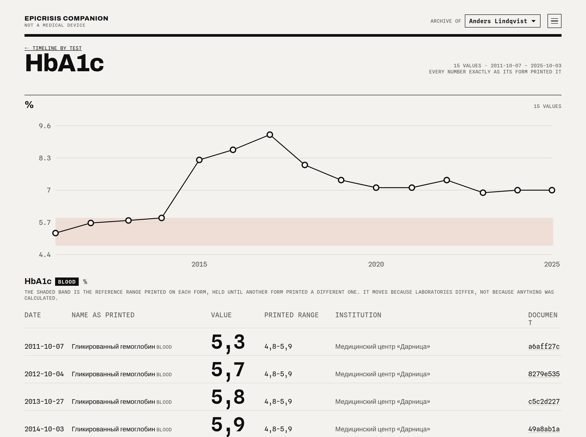

*The shaded band is the reference range **printed on each form**, held until another form printed
a different one. It steps because laboratories differ, not because anything was calculated. The
rows below the chart are Russian where his clinic was Russian, and English after he moved.*

**For your grandmother.** Her archive is small, on paper, in the language of another decade, and
nobody but the family will ever type it up. Twenty documents are still twenty documents you can
hand to a doctor as a chart instead of a plastic bag.

**And for all three at once, without them ever mixing.** One instance, one archive per person, one
index file each. Switching between them is a box at the top of the page.

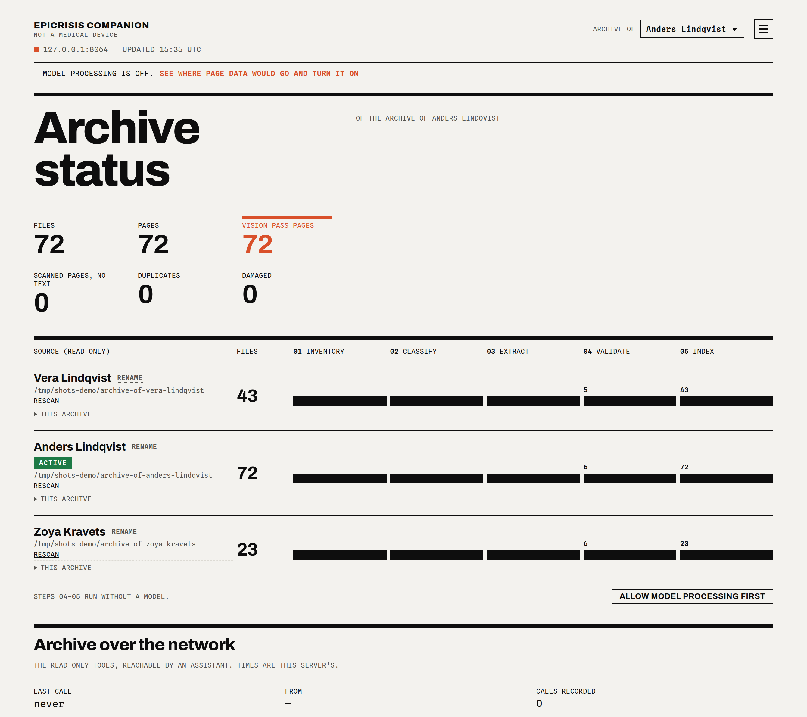

---

## What actually happens to your papers

You point it at a folder. **It never writes to that folder** — it reads.

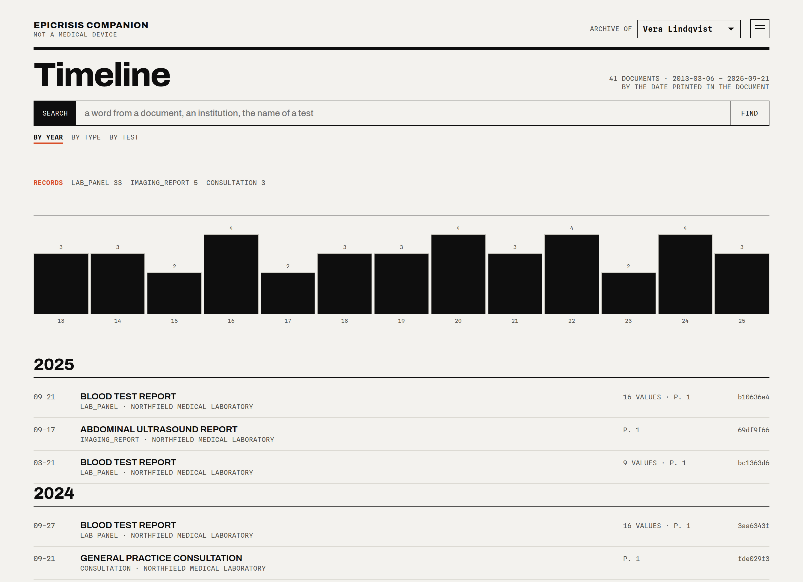

*Every document under the date printed on it: laboratory panels, imaging reports, consultations,
the letter a clinic sent on.*

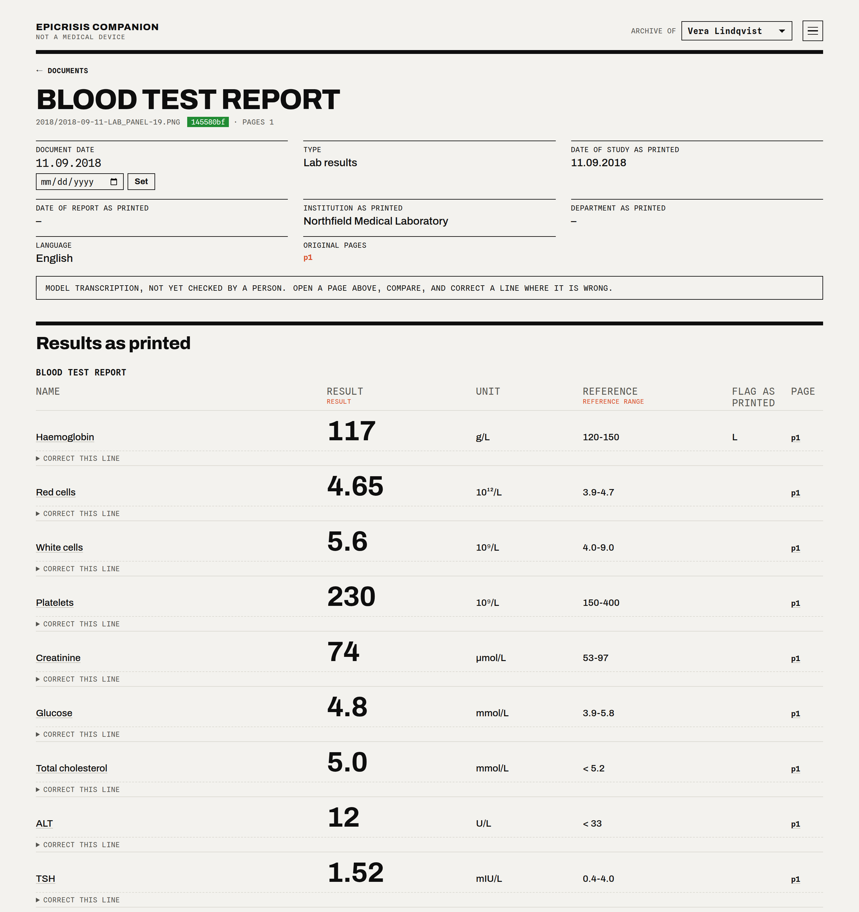

*Open one and it is the form: names as printed, values as printed, units, the range the laboratory
printed beside each value, the mark it put in the margin. The banner says plainly that a model
transcribed this and no person has checked it. Correct a line by hand and the correction outlives
every later re-reading.*

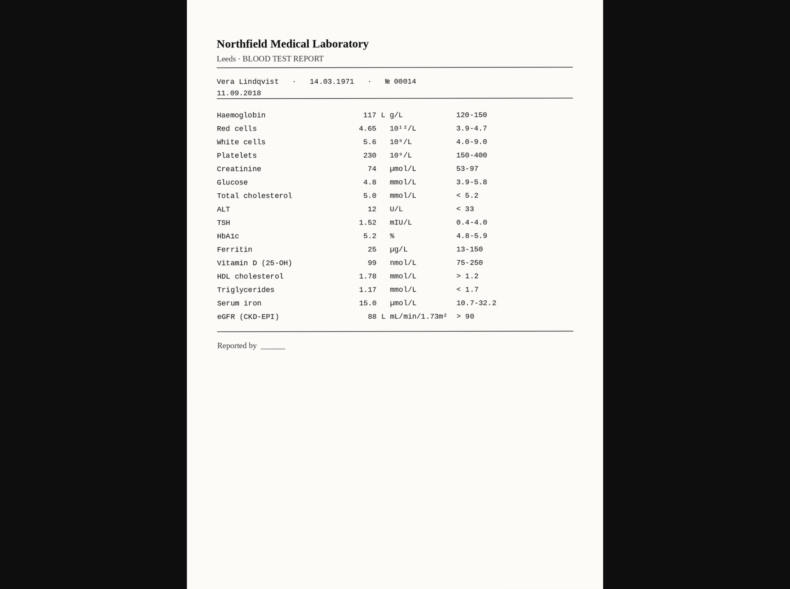

*And the page itself is one click away, served from your own disk. Nothing here asks you to take
its word for anything.*

---

## The charts are careful on purpose

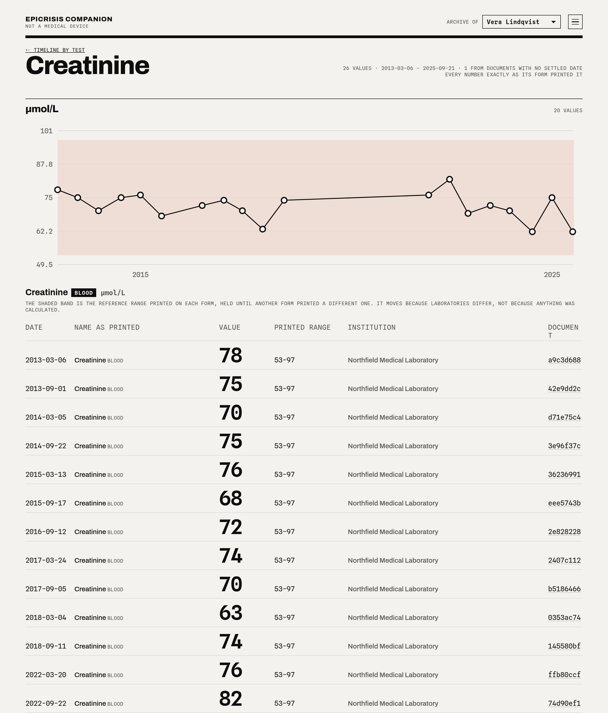

*Creatinine measured in µmol/L in one country and mg/dL in another. Most software would convert
one into the other and draw a single line. Epicrisis draws **two charts**, because the moment a
number is converted it is no longer the number printed on the page a doctor can ask you to show.*

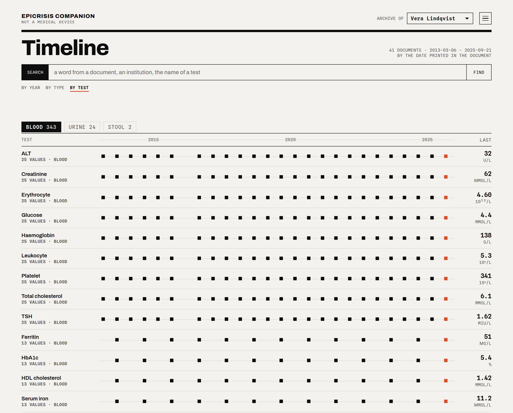

*Blood, urine and stool are kept apart, by a tab. The same printed word — Protein, Glucose,
Leukocytes — is a different measurement in blood and in urine, and a chart that puts them on one
line lies quietly for years.*

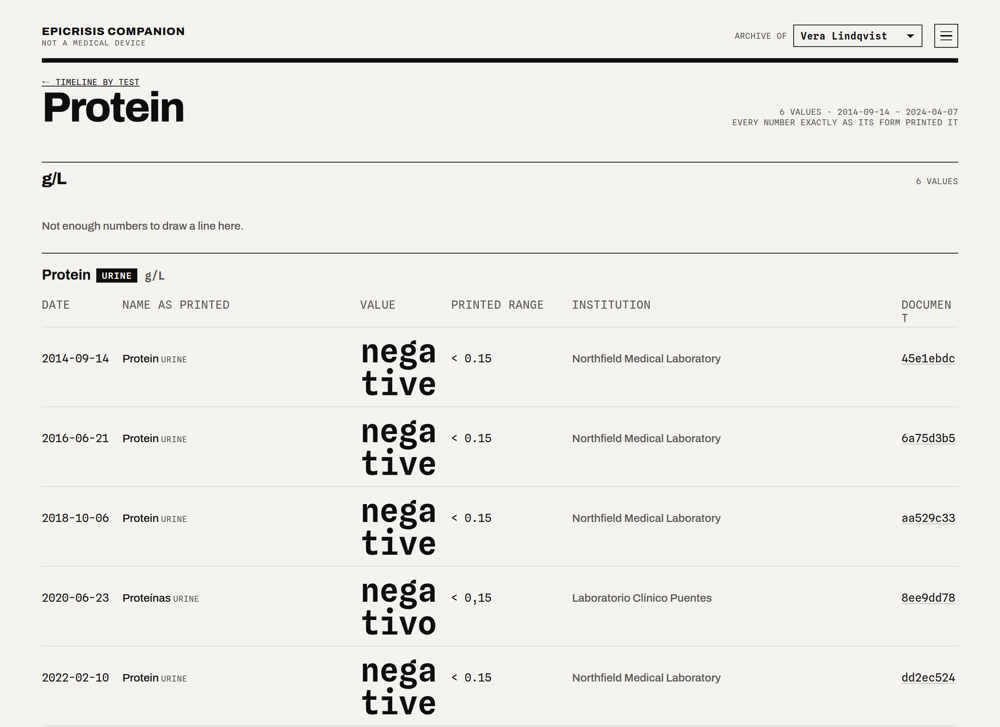

*And where the archive has only a word — "not detected", "straw" — nothing is drawn and the page
says so.*

---

## The machine checks itself

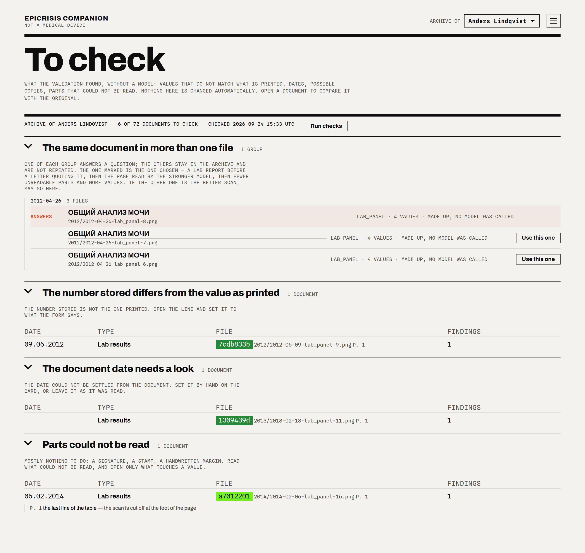

*Models misread pages, so the archive does not trust its own reading. Checks that run **without a
model at all** compare the stored number with the printed text, and find ranges printed backwards,
dates nobody could settle, corners nobody could read, and the same blood draw filed under three
file names. Copies come as a group with one already chosen; you change it only if the choice was
wrong. Nothing is changed for you.*

---

## Five languages, one test

Read and in daily use in **Russian, Ukrainian, English, Spanish and Greek** — including Greek
capitals that lose their accents, headings spaced o u t, and tables printed sideways.

| | |
|---|---|
| 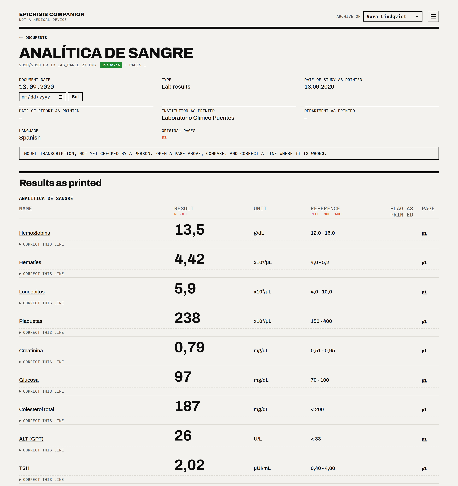 | 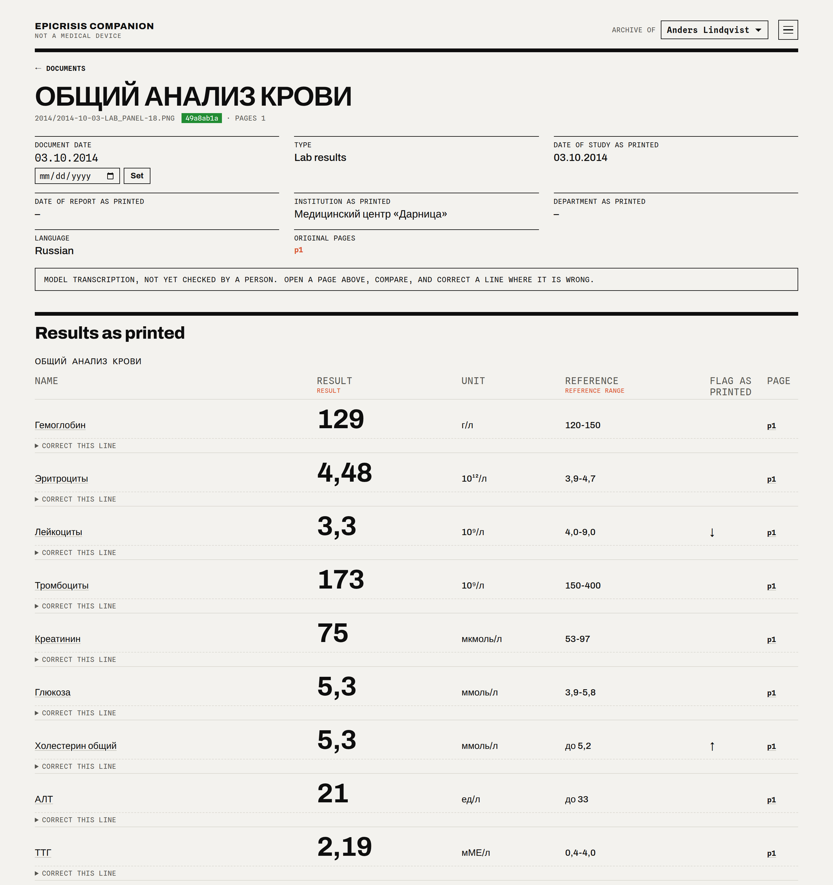 |

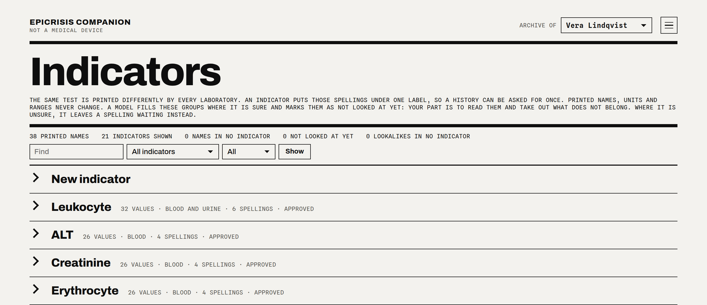

*`Гемоглобін`, `Гемоглобин`, `Hemoglobina`, `Haemoglobin`, `Αιμοσφαιρίνη` are one test. A model
proposes the grouping, a second and deliberately different model reads it again, a reference is
consulted where that is allowed — and then **you** approve it, once, for good. That is what makes
a fifteen-year chart possible at all.*

---

## "Couldn't I just upload the files to a chatbot?"

For one page, yes — and it will read it better than any rule. For an archive it is a different
job, and the difference is structural rather than a matter of prompting.

| | A model reading your files | Epicrisis |
|---|---|---|
| **Scale** | Thousands of pages do not fit in a context window | Read once, stored, indexed; the whole archive answers in milliseconds |
| **Repeatability** | Ask twice, get two answers | The reading is a file on your disk; tomorrow's answer is today's |
| **Provenance** | A number in a chat | Every value carries its file, page and date, and links to the scan |
| **Your corrections** | Die with the conversation | Stored apart from the model's output, keyed to the printed line, reapplied after every re-read |
| **Catching mistakes** | You have to notice | Deterministic checks find them; a second, different model reads again and disagreements are shown |
| **Units and specimens** | Quietly converted, quietly merged | Never converted; split by unit and by specimen |
| **Vocabulary** | Regrouped differently every time | One vocabulary, approved once, in five languages |
| **Several people** | One pile | One archive per person, one index file each, by construction |
| **With no model at all** | Nothing works | Search, charts, index, checks and the whole dashboard |

The model is used for the one thing it is genuinely better at: reading a page. Everything built on
top of that reading is ordinary code you can inspect — which is why this archive keeps working
when the models change.

---

## Tested on

Two real archives on one machine, kept by the people whose archives they are.

| | |
|---|---|
| Documents | **479** |
| Values kept as printed | **5 355** |
| Years covered | **1989–2026** |
| Languages | Russian, Ukrainian, English, Spanish, Greek |
| Institutions as printed | over 200 |
| Tests in the vocabulary | 492 approved groups of spellings |
| Test suite | 292 tests, no network, no model |

Whose they are is nobody's business, and nothing from them appears in this repository: every
screenshot here comes from `epicrisis demo`, which invents its own people.

---

## Your archive stays yours

- **Self-hosted.** Your computer or your own server. No account, no service, no telemetry.
- **The dashboard listens on `127.0.0.1` only.** From anywhere else, through an SSH tunnel.
- **Your scans are read-only.** Nothing is copied, moved or renamed. Everything the program
  derives sits under `data/` and can be deleted and rebuilt from scratch.
- **Each person's archive is a separate database.** A folder belongs to one owner, two owners'
  folders may not contain one another, and ids are random, because folder names carry surnames.
  A question asked of one archive cannot reach another's values.
- **Nothing is sent to a model until you agree once, in writing**, on a page that shows you what
  would be sent. The steps that need no model never ask. The model runs under your own
  subscription or key, one isolated call per document, carrying that document's pages and nothing
  else.
- **If you let an assistant read the archive over the network**, it gets **read-only** tools and
  three locks in front of them:
  - an unguessable secret path — without it, the server answers as if nothing were there;
  - a private tunnel (Tailscale Funnel) that admits only the connector's own network;
  - and **a six-digit code from your authenticator** (RFC 6238): `unlock` returns a pass good for
    four hours, every tool refuses without it, `lock` ends it early. The secret behind that code is
    generated on your server, read once into your phone, and never travels through a conversation.
  - The access log keeps who called and which tool — never the question, never the answer. A log
    of a medical archive that holds the questions is a second copy of the archive.

A secret path and a private tunnel say *where* a request came from and nothing at all about *who*
sent it. The code from a phone is the only part a stranger cannot copy out of an address bar.

**And nothing of yours goes out with the code.** This repository is published from a machine that
holds a real archive, so a check runs before every push:

```sh
uv run python tools/nothing-of-yours.py --data-dir data     # 0 = nothing of yours is in here
git config core.hooksPath .githooks                         # and before every push, from now on
```

It reads the data directory — the people, the institutions that treated them, the folders and
files the scans live in and their hashes — and looks for every one of those in each tracked file
and in every commit ever made, because a file deleted today is still published in the history. It
also looks for this server's own secrets, whole and hashed, and for keys and tokens by their
shape. Nothing it finds is printed: a phrase out of an archive is exactly what must not be
written into a terminal or an issue, so it says what kind of thing matched and in which file.
Names published deliberately — an author's own, in a licence and a copyright line — go in
`published-on-purpose.txt`, which is a person saying so once, in writing.

---

## Try it without a single page of your own

Python 3.14 and [uv](https://docs.astral.sh/uv/).

```sh
uv sync
uv run epicrisis demo --into /tmp/demo          # three invented archives, no model called
uv run epicrisis serve --data-dir /tmp/demo/data
```

Then, when you are ready:

```sh
uv run epicrisis sources add ~/scans --owner "Your name"
uv run epicrisis update        # inventory → classify → extract → validate → index
uv run epicrisis serve
```

Other commands:

```sh
epicrisis check-indicators     # a second model over the test vocabulary
epicrisis mcp [--http]         # read-only tools for an assistant
uv run pytest                  # 292 tests, no network, no model
```

> **Status:** working and in daily use by its author and their family; not yet used by anyone
> else. Data files and interfaces may still change without migration.

---

## The honest part

Epicrisis is **not a medical device**. It is **not for diagnosis, treatment or any clinical
decision**. It stores and shows what your documents say; it does not interpret them, does not
decide what is normal, and does not advise.

A transcription from a scan can be wrong. That is why every value in this program is one click
from the page it came from, and why the page — not the program — is the authority.

## The licence

**Free for a person and their family, for good.** Keeping and reading your own medical records,
your household's, and those of relatives or friends you help without being paid — that is written
into the licence itself, not promised in a README. So is reading the code, changing it, publishing
your changes and running it to try it out.

A clinic, a laboratory, an insurer, an employer or anyone offering this program to other people
needs a commercial licence: [COMMERCIAL.md](COMMERCIAL.md).

The licence is the [Business Source License 1.1](LICENSE), which is source-available rather than
open source, with one thing written into it: **every version becomes Apache 2.0 four years after
it is published.**

Sending a patch: [CONTRIBUTING.md](CONTRIBUTING.md).

**Your data, your machine, your call.**

Copyright © 2026 Artem Berman · [www.bermana.net](https://www.bermana.net)
